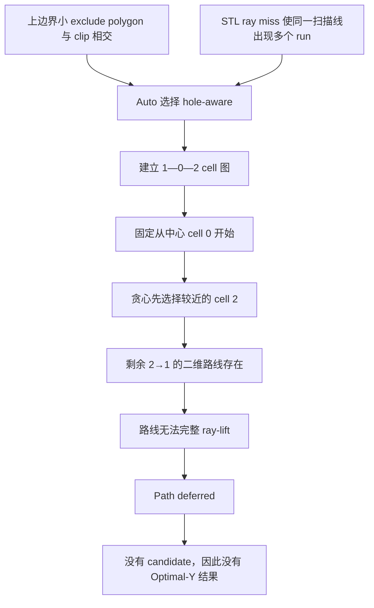

# Hole-Aware、Cell 图、贪心算法与 A* 入门

> **版本说明（2026-07-15）**：本文对 cell 图、贪心和 A* 的讲解仍可作为算法学习资料，
> 其中标为“当前实现”的连续贴面 connector 内容描述的是 2026-07-13 原型，已与现在不同。
> 当前工程保留 run/cell 分解，但按原扫描顺序完整加工每个 cell；cell 之间法向抬刀并
> 离面转场，不再运行 cell 图贪心、A* 或 connector ray-lift。当前合同见
> `HOLE_AWARE_PLANNER.md`，决策见 `DECISION_LOG.md` 的 D013。
> manual-v2 与未划分的原始 face-id region 现在都能进入这套 cell 抬刀规划。

本文面向第一次接触路径规划算法的读者，结合本项目 `1_2` 蓝色加工区域的真实实验，解释：

- 明明肉眼看不到孔，为什么 `auto` 仍会进入 hole-aware；
- raster、scanline、run、cell 分别是什么；
- 什么是 cell 图，为什么访问顺序会决定成败；
- 贪心算法在做什么，为什么“当前最近”不一定得到整体可行结果；
- A* 怎样在二维网格中找路；
- 为什么二维 A* 找到路线后，仍可能无法生成三维路径；
- “分叉 cell 图优先”和“把可 ray-lift 表面加入 A* 导航域”分别要解决什么问题。

本文用于学习和分析。为避免把教学方案误认为现有功能，全文使用以下状态标签：

| 标签 | 含义 |
| --- | --- |
| **【当前实现】** | 当前仓库代码已经按这种方式运行 |
| **【本次诊断】** | 对 `1_2` 当前输入做只读实验得到的事实 |
| **【参考改进·未实现】** | 论文、开源实现或本次分析提出的方向，当前代码尚未实现 |

---

## 1. 先看本次问题的直接结论

本次实验中的 `1_2` 蓝色区域，肉眼看起来没有真正的圆孔。它进入 hole-aware 有两层原因。

### 1.1 第一层：上边界有一个很小的 hole polygon 与 patch 相交

`1_2` 的 clip 范围大致是：

```text
U: -388.378 ～ 360.637
V: -332.896 ～ 55.483
```

manifest 中第 7 个相关 exclude polygon 是一个很小的三角形，其范围大致是：

```text
U: 317.821 ～ 321.275
V: 47.546 ～ 55.500
```

它正好与 `1_2` 的上边界发生很小的相交，因此快速检测函数
`polygon_has_relevant_holes()` 返回 `True`，`auto` 会直接选择 hole-aware。

但本次 `boundary_margin = 10 mm`，这个小三角形非常靠近 patch 上边界，未必真正切到最终加工扫描线。也就是说：

```text
“hole polygon 与 clip 相交”
不一定等于
“hole polygon 实际切断了某条加工扫描线”
```

### 1.2 第二层：即使删除所有显式 hole，仍然会升级到 hole-aware

对 `1_2` 做了只读对照诊断：

```text
保留全部 exclude_polygons：
121 samples，9 runs，3 cells，hole-aware 失败

删除全部 exclude_polygons：
121 samples，9 runs，3 cells，hole-aware 仍然失败
```

这说明真正造成扫描线分裂的不是上方那个小三角形，而是二维采样点向选中 STL 表面投射时，中间有一段位置没有 ray hit。

普通 raster 会发现同一条 scanline 上出现两个互不连续的 run。`auto` 为了避免用一条直线把两个 run 强行连接起来，会再次升级为 hole-aware。

因此，当前代码里的 hole-aware 更准确的理解是：

> 它不只是“圆孔处理器”，而是“扫描域不连续时的安全连续路径规划器”。

触发不连续的原因可以是：

- 显式孔洞；
- patch 外轮廓的凹口；
- 选中 STL cells 在某处没有投射命中；
- 曲面折叠或多层投影造成的缺口；
- clip polygon 覆盖了没有选中表面的区域。

---

## 2. 从三维曲面到二维 raster：先建立整体认识

机器人最终需要的是三维加工点，但规则光栅路径更适合先在二维平面里计算。

本项目的基本过程是：


这里最重要的思想是把问题分成两层：

```text
二维层：哪里允许走、扫描线怎样排列、怎样绕开缺口
三维层：二维点能否落到真实 STL 表面、得到哪个 XYZ 和法向
```

二维层计算快、结构清楚，但它不能自动保证三维层一定可行。

---

## 3. UV、scanline、interval、run、cell 分别是什么

这些词是理解 hole-aware 的基础。

### 3.1 Raster UV 坐标系

可以把曲面附近想象成铺了一张局部方格纸：

```text
U 轴：方格纸的横向
V 轴：方格纸的纵向
Normal：垂直方格纸、指向三维曲面的方向
```

`raster_chart` 保存：

```text
origin   局部坐标原点
u_axis   U 方向
v_axis   V 方向
normal   投射方向
```

一个三维点可以投影成 `(u, v)`；一个二维 `(u, v)` 也可以沿 normal 发射射线，尝试落回 STL 表面。

### 3.2 Scanline：扫描线

假设主要加工方向沿 U 轴，就会每隔一定距离在 V 方向生成一条水平扫描线：

```text
V=0    ----------------------
V=50   ----------------------
V=100  ----------------------
```

本次实验：

```text
scanline spacing = 50 mm
同一条线上的 point step = 50 mm
```

### 3.3 Interval：允许加工的连续区间

扫描线与 patch 外轮廓相交后，得到允许加工的区间。

没有孔时：

```text
|============================|
```

中间有孔时：

```text
|==========|  HOLE  |=========|
```

一条扫描线可能从一个 interval 变成两个 interval。

### 3.4 Run：一次连续采样段

一个 interval 中能连续 ray-lift 到 STL 的采样点构成一个 run。

即使没有显式 hole，也可能因为中间几个点没有命中 STL 而分裂：

```text
二维 interval： |==============================|
STL ray hit：   ● ● ● ● ● × × × × ● ● ● ● ●
最终 runs：     | run A |         | run B |
```

所以：

```text
interval 是二维几何允许范围
run 是经过三维投射验证后真正有加工点的连续段
```

### 3.5 Cell：跨多条扫描线保持连通的一组 runs

相邻扫描线上的 runs 如果在 U 方向有足够重叠，就认为它们属于同一个连续加工区域。

例如：

```text
line 0:  |=======================|
line 1:  |=======================|
line 2:  |=======================|
```

这三条 run 可以属于同一个 cell。

如果下一条线突然分成两段：

```text
line 3:  |========|     |========|
```

就会产生分叉，形成新的 cells。

---

## 4. 什么是 cell 图

“图”不是图片，而是一种数学数据结构：

```text
节点 node：一个 cell
边 edge：两个 cell 之间存在相邻/可连接关系
```

例如：

```text
cell 1 —— cell 0 —— cell 2
```

可以简写成：

```text
1 — 0 — 2
```

这就是本次 `1_2` 的真实 cell 图。

其中：

```text
cell 0：包含 7 条连续 run，是下方主体
cell 1：包含上方左侧 1 条 run
cell 2：包含上方右侧 1 条 run
```

形状可以想象为：

```text
上方：       [ cell 1 ]       [ cell 2 ]
                    \         /
下方：             [  cell 0  ]
```

cell 0 与左右两个分支都能连接，但两个分支之间不能直接在真实表面上连接。

### 4.1 为什么访问顺序很重要

如果顺序是：

```text
cell 1 → cell 0 → cell 2
```

两次连接都能 ray-lift，路径可行。

如果从中心开始：

```text
cell 0 → cell 2 → cell 1
```

最后一步必须从右分支直接去左分支。二维 clip polygon 中虽然能画出一条路线，但路线经过的中间区域没有选中 STL 表面支撑，ray-lift 失败。

所以：

> 每一段局部连接都存在，不代表随便选择访问顺序都能完成整个路径。

---

## 5. 【当前实现】当前算法怎样选择第一个 cell

当前实现选择“最早扫描线所在的 cell”作为第一个 cell：

```python
first_cell = min(
    cells,
    key=lambda cell: min(run.line_index for run in cell.runs),
)
```

在 `1_2` 中，最早扫描线属于主体 `cell 0`，因此起点固定为中心节点。

然后算法不断从尚未访问的 cells 中选一个连接代价最小的目标，而且已访问 cell 不再进入候选集合。

这相当于要求：

```text
每个 cell 只访问一次
不能回到已经完成的 cell
```

对于一条简单链：

```text
1 — 0 — 2
```

如果从端点 1 开始，可以一次走完：

```text
1 → 0 → 2
```

如果从中间 0 开始，无论先走左边还是右边，最后都需要一次“叶子到叶子”的连接：

```text
0 → 1 → 2   最后需要 1 → 2
0 → 2 → 1   最后需要 2 → 1
```

这就是本次失败的核心。

---

## 6. 【参考改进·未实现】什么是分叉 cell 图优先

“分叉 cell 图优先”不是一个固定教科书算法名称，这里表达的是一种规划策略：

> 在选择起点和访问顺序前，先观察 cell 图的分叉结构，不只看哪一段距离最近。

### 6.1 节点的度数

一个节点连接了多少条边，称为它的度数 degree。

对图：

```text
1 — 0 — 2
```

有：

```text
degree(0) = 2
degree(1) = 1
degree(2) = 1
```

度数为 1 的节点常被称为叶子节点。

### 6.2 为什么可以优先从叶子开始

如果一张图近似树结构，从叶子开始通常更不容易把自己困在分支末端。

本例中：

```text
从叶子 1 开始：1 → 0 → 2，可行
从中心 0 开始：走到任一叶子后，难以前往另一个叶子
```

最基础的改进思想可以是：

```text
1. 建立 cell 邻接图
2. 查找 degree = 1 的叶子
3. 优先从叶子中选择起点
4. 再计算完整访问顺序
```

但“叶子优先”也不是万能规则。复杂图可能有环、多处分叉或某些边实际无法 ray-lift，所以仍要验证完整顺序。

### 6.3 DFS、回溯和允许重访

另一种思路是深度优先搜索 DFS：

```text
沿一个分支走到底
没有路时退回父节点
再访问下一个分支
```

概念示例：

```text
0 → 1 → 回到 0 → 2
```

这会重访 cell 0 的部分连接区域。它可能增加空走距离，但比直接宣布无解更有机会完成覆盖。

这里要区分：

```text
重访加工 cell：可能造成重复加工，需要谨慎
重访已验证 connector：只作为过渡运动，通常更容易控制
```

因此实际改进常常不是“重新加工整个 cell 0”，而是保存一条经过 cell 0 有效表面的 connector 作为返回通道。

---

## 7. 什么是贪心算法

贪心算法的核心思想是：

> 每一步都选择当前看起来最好的方案，希望这些局部最优选择最后形成一个好的整体结果。

### 7.1 生活中的例子

你要去多个地点送货，贪心策略可以是：

```text
每次去离当前位置最近的、尚未访问的地点
```

优点：

- 简单；
- 计算快；
- 结果稳定；
- 很多普通情况效果不错。

缺点：

- 只考虑当前一步；
- 可能提前进入死路；
- 不保证全局最短；
- 甚至不保证最后有解。

### 7.2 当前 hole-aware 中的贪心选择

当前候选大致按以下优先级排序：

```text
1. 相邻 cell 优先
2. connector 距离较短优先
3. cell id 和方向作为确定性排序
```

在本次 `1_2` 中，从 cell 0 出发：

```text
0 → 2 的 connector 约 50 mm
0 → 1 的 connector 约 552 mm
```

贪心自然选择：

```text
0 → 2
```

这一步单独看非常合理，但走完 cell 2 后，去 cell 1 的 connector 虽然二维有路，却无法 ray-lift。

所以这是一个典型例子：

```text
局部最短选择 ≠ 整体可行选择
```

### 7.3 贪心与回溯的区别

纯贪心：

```text
选择一个最好候选
选择后不反悔
失败则整体失败
```

带回溯搜索：

```text
先尝试最好候选
如果后续走不通，退回来尝试第二候选
```

但要注意，本例即使从 cell 0 先选择 cell 1，之后也需要 `1 → 2`，仍然失败。因此只给当前贪心加一次回溯还不够，还需要改变起始 cell 或允许重访中心连接区域。

---

## 8. A* 算法是干什么的

A* 读作“A star”。它用于在图或网格中寻找从起点到终点的低代价路径。

常见应用：

- 游戏角色绕墙移动；
- 移动机器人栅格导航；
- 仓库 AGV 路径规划；
- 本项目中在二维有效加工域内绕开 hole。

### 8.1 先把连续平面变成网格

假设二维区域是：

```text
S . . # . . G
. . . # . . .
. . . # . . .
. . . . . . .
```

其中：

```text
S = start
G = goal
# = 障碍
. = 可通行网格节点
```

A* 的任务是从 S 找到 G，同时避开 `#`。

### 8.2 A* 的三个核心数值

对每个候选节点 `n`，A* 计算：

```text
g(n) = 从起点走到 n 已经付出的真实代价
h(n) = 从 n 到终点的预计剩余代价
f(n) = g(n) + h(n)
```

算法每次优先扩展 `f` 最小的节点。

可以把它理解为：

```text
不能只看已经走了多远，也不能只看离目标还多远；
要同时考虑“已付出代价 + 预计剩余代价”。
```

### 8.3 `g` 和 `h` 各自负责什么

如果只看 `g`：

```text
会像水波一样向四周均匀扩散
这是 Dijkstra 算法的思想
可靠，但可能搜索很多无关区域
```

如果只看 `h`：

```text
会只盯着目标方向前进
这是 greedy best-first search 的思想
快，但可能被障碍骗进死路
```

A* 把两者结合：

```text
既不忘记已经付出的代价
又利用目标方向减少无意义搜索
```

### 8.4 启发函数 heuristic

`h(n)` 又叫启发函数。

常见选择：

```text
四方向网格：Manhattan distance = |dx| + |dy|
允许斜走：Euclidean distance = sqrt(dx² + dy²)
```

本项目允许八方向邻居，并使用欧氏距离作为预计代价。

如果 `h` 从不高估真实最短距离，A* 通常可以保证找到最短路径。这种启发函数称为 admissible heuristic。

### 8.5 Open set 与 Closed set

学习 A* 时常见两个集合：

```text
Open set：已经发现，但还没有正式展开的候选节点
Closed set：已经处理过的节点
```

基本过程：

```text
1. 把起点放进 Open set
2. 取出 f 最小的节点
3. 如果它是终点，结束
4. 检查它的邻居
5. 如果找到更低代价的到达方式，更新邻居的 g 和父节点
6. 重复
```

简化伪代码：

```python
open_set = {start}
g[start] = 0

while open_set:
    current = node_with_smallest(g[node] + h(node))

    if current == goal:
        return rebuild_path_from_parents()

    remove current from open_set

    for neighbor in current.neighbors:
        if neighbor is blocked:
            continue

        new_cost = g[current] + distance(current, neighbor)
        if new_cost < g.get(neighbor, infinity):
            parent[neighbor] = current
            g[neighbor] = new_cost
            add neighbor to open_set

return no_path
```

### 8.6 本项目的 A* 网格分辨率

本项目 connector A* 初始 resolution 大致是：

```text
resolution = 0.5 × min(scanline spacing, point step)
```

本次 spacing 和 point step 都是 50 mm，所以：

```text
resolution = 25 mm
```

网格越细：

```text
优点：能识别窄通道，路线更贴合边界
缺点：节点数变多，计算和内存开销增大
```

网格越粗：

```text
优点：计算快
缺点：窄通道可能在网格上消失，被误判为无路
```

当前实现还会限制网格节点总数；大区域节点过多时，会自动放大 resolution。这是文档中“窄通道可能被判定失败”的来源之一。

---

## 9. 什么是 A* 导航域

A* 不知道什么是加工面，它只知道哪些节点可通行。定义“可通行节点”的规则，就是导航域。

### 9.1 当前二维导航域

当前 `_free(point)` 的含义基本是：

```text
点在 clip polygon 内
并且
点不在任何 hole polygon 内
```

可以写成集合关系：

```text
Free2D = ClipPolygon - HolePolygons
```

这能保证二维 connector 不穿显式孔，也不走出 clip 外轮廓。

### 9.2 当前导航域缺少什么

它没有在 A* 搜索阶段判断：

```text
这个 UV 节点沿 chart normal 是否能命中选中的 STL cells？
```

所以可能出现：

```text
二维 A*：这里在 polygon 内、也不在 hole 内，可以走
三维 ray-lift：这里没有选中的 STL 表面，无法生成 XYZ
```

这正是本次 `1_2` 叶子到叶子连接的情况。

### 9.3 【参考改进·未实现】加入可 ray-lift 表面后的导航域

概念上的改进是：

```text
Free = (ClipPolygon - HolePolygons) ∩ LiftableSurface
```

其中 `LiftableSurface` 表示：

```text
沿 chart normal 发射射线后，能够命中当前 selected face ids 的 UV 区域
```

这样 A* 在搜索时就不会把“二维看似自由、三维没有表面”的区域当作可通行节点。

### 9.4 为什么不能只在最后 ray-lift

只在最后验证的过程是：

```text
先花时间找出一条二维路线
再逐点 ray-lift
中间任意一点失败，就丢弃整条路线
```

如果 liftability 已经进入导航域：

```text
A* 从一开始就绕开没有表面支撑的节点
```

但代价是每个网格节点都要查询 STL，计算会更贵。工程上常用缓存或预生成 liftable mask 降低成本。

---

## 10. 什么是 ray-lift

ray-lift 是把二维 UV 点恢复成三维曲面点的过程。

### 10.1 基本过程

已知二维点 `(u, v)`，先在 chart 平面中得到一个三维基准点：

```text
plane_point = origin + u × u_axis + v × v_axis
```

然后沿 `chart.normal` 方向作一条无限直线，与 selected STL triangles 求交。

如果命中三角形，就得到：

```text
XYZ
triangle face id
facet normal
沿 normal 的距离
```

如果没有命中，则该 UV 点不能生成路径点。

### 10.2 为什么要记录 previous distance

有些 UV 位置可能沿 normal 命中多个表面，例如上下两层曲面。

为了避免路径突然从一层跳到另一层，代码会优先选择与上一个命中距离最接近的交点：

```text
当前交点距离 ≈ 上一个交点距离
```

这是一种保持曲面层连续性的局部策略。

### 10.3 二维 valid 不等于机器人 valid

即使所有 connector 点都能 ray-lift，也只说明：

```text
二维不穿孔
三维有选中表面支撑
```

仍然没有证明：

- ABB 机器人可达；
- 姿态连续；
- 无奇异点；
- 工具外形不碰孔边；
- 机器人、法兰、工具与工件无碰撞；
- 速度和加速度满足要求。

这些仍需 RobotStudio 或后续专门验证。

---

## 11. 【本次诊断】用本次 `1_2` 完整重放一次算法

### 第一步：auto 快速检查 hole polygon

发现上边界小三角形与 clip polygon 相交：

```text
relevant_holes = True
```

因此直接选择 hole-aware。

### 第二步：生成普通二维 raster samples

得到：

```text
121 samples
9 runs
```

最后一条相关扫描线分成左右两个 run。

### 第三步：建立 cells

得到：

```text
cell 0：7 runs
cell 1：1 run
cell 2：1 run
```

邻接图：

```text
1 — 0 — 2
```

### 第四步：固定从最早扫描线的 cell 0 开始

```text
current = cell 0
unvisited = {cell 1, cell 2}
```

### 第五步：对每个候选运行 A* 和 ray-lift

```text
0 → 1：A* 有路，ray-lift 成功，距离约 552 mm
0 → 2：A* 有路，ray-lift 成功，距离约 50 mm
```

贪心选择较短的：

```text
0 → 2
```

### 第六步：尝试访问剩余 cell 1

```text
2 → 1：二维 A* 有路
2 → 1：connector ray-lift 失败
```

没有其他未访问 cell 可选，于是返回：

```text
No free-domain connector between raster cells.
```

这个消息不够精确。真实情况不是“二维 A* 没找到路线”，而是：

```text
二维路线存在，但路线不能完整投射到 selected STL surface
```

### 第七步：为什么说整体方案其实存在

诊断验证了：

```text
1 → 0：A* 有路，ray-lift 成功
0 → 2：A* 有路，ray-lift 成功
```

因此顺序：

```text
1 → 0 → 2
```

在当前 connector 和 ray-lift 判定下是可行的。

这证明本次 deferred 是访问顺序限制，不是蓝色区域真的无法生成连续表面路径。

---

## 12. 【参考改进·未实现】几种改进思路分别解决什么问题

以下是学习层面的方案比较，不代表应一次全部实现。

### 12.1 方案 A：从叶子 cell 开始

步骤：

```text
1. 建立 cell 图
2. 找 degree = 1 的节点
3. 从叶子中选择合适起点
4. 再运行访问排序
```

解决：

```text
像 1—0—2 这种链式分叉，中心起步会把自己困住的问题
```

优点：简单、改动小。

限制：复杂图不一定只靠叶子起点就能解决。

### 12.2 方案 B：完整顺序搜索与回溯

步骤：

```text
1. 尝试一个 cell 顺序
2. 后续失败时回退
3. 尝试其他起点、方向或访问顺序
```

解决：

```text
贪心局部选择导致后续死路的问题
```

优点：比纯贪心更可靠。

限制：cell 多时组合数可能快速增长，需要剪枝和上限。

### 12.3 方案 C：允许通过已验证 connector 重访父区域

示意：

```text
0 → 1 → 沿已验证表面返回 0 → 2
```

解决：

```text
树状分叉无法做到每个 cell 只访问一次的问题
```

优点：对树形结构自然。

限制：会增加非加工移动，需要避免重复磨削并确认 MoveL 安全性。

### 12.4 方案 D：把 liftable surface 加入 A* 导航域

从：

```text
Free2D = clip - holes
```

改成概念上的：

```text
Free = (clip - holes) ∩ liftable surface
```

解决：

```text
A* 二维有路，但最后 ray-lift 才失败的问题
```

优点：错误更早暴露，搜索结果更符合真实表面。

限制：网格节点需要 STL 查询，需缓存以控制速度。

### 12.5 方案 E：改进诊断信息

建议区分：

```text
no_2d_route
route_found_but_ray_lift_failed
no_start_grid_node
no_end_grid_node
grid_resolution_too_coarse
cell_order_exhausted
```

解决：

```text
所有 connector 问题都显示为同一句 No free-domain connector，难以判断真实原因
```

### 12.6 与经典 Boustrophedon 和成熟开源实现的差异

**【当前实现】** 当前原型固定从最早 scanline 所属 cell 开始，只从 `unvisited`
集合选择下一 cell，并按“相邻优先、connector 较短优先”做贪心选择。访问过的 cell
不会再次作为过渡节点。因此 `1—0—2` 从中心 `0` 出发时，会被迫尝试不可 lift 的
叶子到叶子连接。

**【参考改进·未实现】** 经典 Boustrophedon Cellular Decomposition 建立 cell 邻接图，
再用类似 DFS 的 exhaustive walk 覆盖该图；进入已经完成的 cell 时，可以只穿过它前往
下一 cell，而不是重新加工。这意味着树形分叉允许走 `0→1→0→2`，不会额外要求 cell 图
存在“一次且仅一次访问所有节点”的路径。

进一步的成熟实现还会把“每个 cell 的多种起点、终点和扫描方向”与“cell 之间的可行
connector”一起做全局排序，而不是只选当前最近目标：

- [CMU：Coverage Path Planning: The Boustrophedon Decomposition](https://publications.ri.cmu.edu/coverage-path-planning-the-boustrophedon-decomposition/)
- [ETH Zürich：Revisiting Boustrophedon Coverage Path Planning as a GTSP](https://arxiv.org/abs/1907.09224)
- [ETH Zürich 开源实现：polygon_coverage_planning](https://github.com/ethz-asl/polygon_coverage_planning)
- [Fields2Cover 路径顺序规划](https://fields2cover.github.io/source/tutorials/route_planning.html)

这些项目主要解决二维移动机器人或飞行器问题。本项目还必须增加 selected STL
ray-lift、曲面层连续、工具包络和机器人可达性约束，不能直接复制其二维连接结果。

---

## 13. Auto、legacy、hole-aware 三者关系

### 13.1 Legacy raster

主要职责：

```text
快速生成扫描线采样点
把断开的 run 作为不同 segment
```

优点：简单、快速、容易看到是否能产生加工点。

限制：它不是跨多个 cell 的连续贴面顺序优化器，segment 之间通常需要安全抬刀/接近动作。

### 13.2 Hole-aware

主要职责：

```text
识别多个 runs/cells
完成一个 cell 后再进入另一个 cell
在有效二维域中规划 connector
把 connector 逐点 ray-lift 到表面
整个 patch 只保留全局首尾安全点
```

### 13.3 Auto

`auto` 是分流器，不是第三种几何算法。

逻辑可简化为：

```python
if clip 与某个 hole polygon 相交:
    使用 hole-aware
else:
    先运行普通 raster
    if 同一扫描线出现多个 run:
        升级到 hole-aware
    else:
        保留普通 raster
```

所以“进入 hole-aware”不等于系统认定这里一定有肉眼可见的孔。

---

## 14. 对本次蓝色区域应怎样理解

推荐把本次现象表述为：

> `1_2` 的加工域没有明显实体孔，但 patch 上边界有一个极小 exclude polygon 与 clip 相交；同时 selected STL 的 ray-lift 支撑域在最后一条相关扫描线上发生分裂。Auto 因任一条件都会升级到 hole-aware。最终失败来自 cell 图访问顺序和二维导航域未包含 liftable-surface 约束，而不是加工区域本身绝对无路。

不要简化成以下任一种说法：

```text
错误说法 1：因为有孔，所以无解。
错误说法 2：A* 完全找不到二维路线。
错误说法 3：STL 上完全没有连续表面。
错误说法 4：Optimal-Y 算法算不出最佳位置。
```

更准确的因果链是：



---

## 15. 对照源码阅读

建议按以下顺序阅读：

### 15.1 Auto 分流

文件：

```text
scripts/optimal_y_score_configurable.py
```

重点：

```text
polygon_has_relevant_holes()
path_has_split_scanlines()
use_hole_aware
```

### 15.2 二维 raster 与 ray-lift

文件：

```text
scripts/raster_domain.py
```

建议顺序：

```text
patch_axes()
polygon_scanline_intervals()
subtract_intervals()
raster_samples()
line_triangle_hit()
lift_uv()
```

### 15.3 Cell 分解、贪心与 A*

文件：

```text
experimental_algorithms/hole_aware_raster.py
```

建议顺序：

```text
RasterRun / RasterCell
_make_runs()
_build_cells()
_free()
_segment_is_free()
_grid_route()
_lift_connector()
hole_aware_raster_samples()
```

### 15.4 导出与 deferred

文件：

```text
scripts/window_conf_export.py
```

重点：

```text
plan_region_uv()
plan_region_uv_hole_aware()
PathResult.message
```

---

## 16. 初学者练习题

### 练习 1：判断起点

图：

```text
A — B — C
```

问题：如果每个节点只能访问一次，从哪个节点开始最容易一次走完？

答案：A 或 C。B 是中间节点，从 B 开始访问任一端点后，需要从一个端点直接跳到另一个端点。

### 练习 2：找出贪心陷阱

假设：

```text
0 → 1 距离 100，可继续到 2
0 → 2 距离 20，但 2 无法继续到 1
```

纯最近距离贪心会选什么？

答案：选 2，但这会导致后续无路。整体可行顺序应先走 1。

### 练习 3：理解 A*

已知某节点：

```text
g = 30
h = 50
```

则：

```text
f = 80
```

另一个节点 `g=60, h=10`，`f=70`，A* 会优先展开第二个节点。

### 练习 4：导航域判断

某 UV 点：

```text
在 clip 内
不在 hole 内
但沿 normal 无法命中 selected STL cells
```

当前二维 `_free()` 会认为它可通行，但加入 liftable-surface mask 后应认为它不可通行。

### 练习 5：分辨失败阶段

```text
A* 返回 route != None
_lift_connector(route) 返回 None
```

这表示：二维路线存在，但三维表面投射失败，不应记录成单纯的“二维无路”。

---

## 17. 术语速查

| 术语 | 简单解释 |
| --- | --- |
| Raster | 按规则间距排列的光栅扫描路径 |
| UV | 曲面附近的局部二维坐标 |
| Scanline | 一条扫描线 |
| Interval | 扫描线上允许加工的连续二维区间 |
| Run | 经过 ray-lift 后真正连续有效的一段采样点 |
| Cell | 在多条相邻扫描线上保持连通的一组 runs |
| Graph | 由节点和边组成的关系结构 |
| Degree | 一个图节点连接的边数 |
| Leaf | degree=1 的叶子节点 |
| Greedy | 每一步选择当前局部最优候选 |
| Backtracking | 后续失败时退回并尝试其他选择 |
| DFS | 沿一个分支深入，结束后返回探索其他分支 |
| A* | 使用 `f=g+h` 在图或网格中寻找低代价路线 |
| Heuristic | 对剩余代价的估计函数 `h` |
| Navigation domain | A* 被允许搜索和通行的区域 |
| Ray-lift | 把二维 UV 点沿 chart normal 投射到三维 STL |
| Deferred | 为避免生成不安全路径而拒绝当前候选 |

---

## 18. 最后总结

记住下面五句话，就掌握了本次问题的核心：

1. Hole-aware 不只处理肉眼可见的孔，也处理同一扫描线上的不连续 runs。
2. Cell 图描述多个连续加工区域之间的连接关系，访问顺序会决定整体是否可行。
3. 贪心算法只保证当前选择看起来最好，不保证后续一定有路。
4. A* 只会遵守提供给它的导航域；导航域没有 STL liftability，A* 就可能找到无法落到三维表面的路线。
5. 本次 `1_2` 不是绝对无路，`1 → 0 → 2` 可行；失败来自固定中心起点、不可重访和导航域定义的组合限制。
