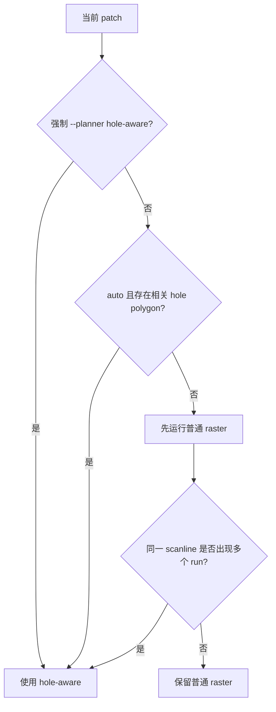
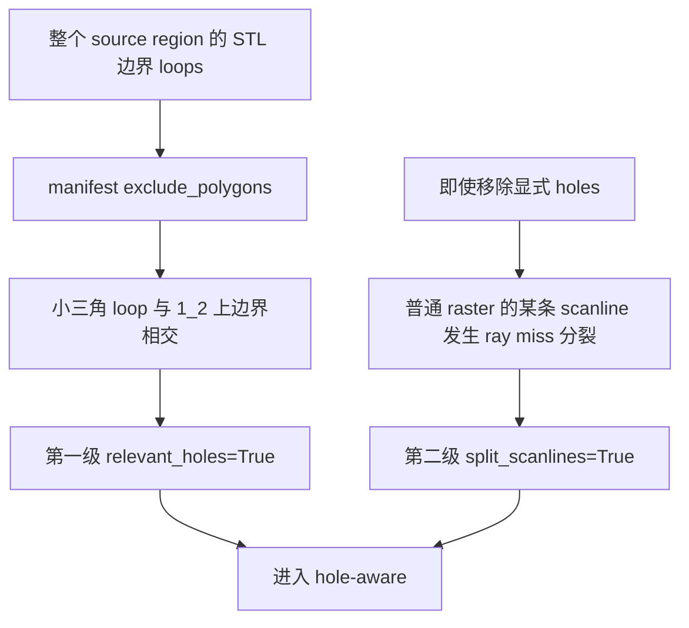

# Auto 如何判断“带孔区域”：当前代码与教学说明

> **版本说明（2026-07-15）**：自动判定仍保留“相关 exclude”与“同一扫描线多个 run”
> 两级触发，但相关 exclude 现在明确为与 clip 有正面积重叠：完全位于 clip 内是真正内部孔，
> 穿过边界也是相关排除区，仅边界接触不算。触发后采用 cell 内完整光栅、cell 间抬刀
> 转场；本文后半部分关于 A*/connector 失败的内容是旧原型分析，仅供学习和历史对照。
> 2026-07-15 后，未划分的原始 face-id region 也能直接用 projected runs 建立 cells，
> 不再要求为了处理 split-scanline 先生成 manual-v2 manifest。

本文只讲一个问题：

> `auto` planner 到底怎样判断一个 patch 要不要进入 hole-aware？

先给出最重要的结论：

> 当前代码不是简单地判断“模型上有没有圆孔”，而是通过“显式排除多边形相交”和“实际扫描线是否分裂”两级规则，判断当前 patch 是否需要使用 hole-aware 安全策略。

因此，肉眼看不到孔的区域也可能进入 hole-aware。

全文状态标记：

| 标签 | 含义 |
| --- | --- |
| **【当前实现】** | 当前仓库代码的真实行为 |
| **【本次诊断】** | 对当前 `1_2` 输入做只读实验得到的事实 |
| **【参考建议·未实现】** | 为改善分类或日志提出的建议，当前代码尚未实现 |

---

## 1. 【当前实现】最核心的代码在哪里

### 1.1 Auto 分流总入口

实际分流函数在：

```text
scripts/window_conf_export.py::plan_region_uv_auto()
```

`scripts/configurable_experiment_runner.py::run_optimal_scan()` 在正式批量运行时调用该函数；
实验 UI 的快速预览也调用同一个函数。核心逻辑是：

```python
if polygon_has_relevant_holes(clip_polygon, holes):
    return plan_region_uv_hole_aware(...), True, "exclude-overlap"

regular_path = plan_region_uv(...)
if path_has_split_scanlines(regular_path):
    return plan_region_uv_hole_aware(...), True, "split-scanline"

return regular_path, False, "regular-raster"
```

可以画成：



所以一共有两个自动触发点：

```text
第一次触发：clip polygon 与某个 exclude polygon 相交
第二次触发：普通 raster 后，同一扫描线出现多个不连续 run
```

---

## 2. 第一级判定：是否存在“相关 hole polygon”

### 2.1 判定函数

文件：

```text
experimental_algorithms/hole_aware_raster.py
```

函数：

```python
polygon_has_relevant_holes(polygon, holes)
```

它的任务不是识别三维圆孔，而是回答：

```text
当前 patch 的二维 clip polygon
是否与 manifest 中任意 exclude polygon 相交？
```

### 2.2 判定分为三步

对每个 hole polygon：

#### 第一步：包围盒快速排除

分别计算 patch 和 hole 的：

```text
min_x, min_y, max_x, max_y
```

如果两个包围盒完全分离，就直接认为这个 hole 与当前 patch 无关。

示例：

```text
patch: U = 0～100
hole:  U = 150～170
```

两者 U 范围完全分离，不需要做更复杂的多边形计算。

包围盒检测只是快速拒绝，包围盒重叠不代表多边形一定相交。

#### 第二步：点包含测试

检查：

```text
hole 是否有顶点在 patch 内
或者
patch 是否有顶点在 hole 内
```

任意一个成立，就认为 hole 与 patch 相关。

点是否在多边形内使用的是射线奇偶规则。可以想象从测试点向右发一条射线：

```text
穿过多边形边界奇数次：点在内部
穿过多边形边界偶数次：点在外部
```

#### 第三步：边相交测试

有些多边形互相穿过，但没有任何顶点落在对方内部。

因此还要检查：

```text
patch 的任意边
是否与
hole 的任意边相交
```

只要存在一对“穿过彼此内部”的边，就返回 `True`。当前实现使用严格相交测试，单点接触
或沿边界贴合不算相关 hole；这与文件开头所说的“正面积重叠”一致。

### 2.3 简化伪代码

```python
def polygon_has_relevant_holes(patch, holes):
    if patch 为空 or holes 为空:
        return False

    for hole in holes:
        if hole 与 patch 的包围盒完全分离:
            continue

        if hole 的某个点在 patch 内:
            return True

        if patch 的某个点在 hole 内:
            return True

        if patch 边与 hole 边发生严格内部相交:
            return True

    return False
```

### 2.4 这个函数没有判断什么

它没有判断：

- hole 是不是圆形；
- hole 面积是否足够大；
- hole 是否切到最终 scanline；
- hole 是否位于 `boundary_margin` 内侧；
- hole 是否真的对应 CAD 通孔；
- hole 内是否完全没有 STL；
- 工具实体是否能从孔旁安全通过。

它只做二维多边形相交测试。

---

## 3. `exclude_polygons` 是从哪里来的

理解这一点非常重要。运行阶段不是临时从图片上识别孔，而是读取之前写进 manifest 的二维孔多边形。

### 3.1 先从选中 STL 三角面提取边界边

文件：

```text
scripts/manual_region_partitioning.py
```

函数：

```python
boundary_loops_xy()
```

大致位于第 285～330 行。

基本思想：

```text
一条三角形边只出现 1 次：它是选中区域边界
一条三角形边出现 2 次：它是两个相邻三角形共享的内部边
```

代码会：

```text
1. 遍历所有选中三角形的三条边
2. 对坐标做量化，给相同端点建立统一 key
3. 统计每条边出现次数
4. 只保留 count == 1 的边界边
5. 根据端点邻接关系，把边界边串成闭合 loops
6. 按 loop 面积从大到小排序
```

示意：

```text
┌─────────────────────┐  最大 loop：外轮廓
│                     │
│      ┌───────┐      │  小 loop：内部孔或缺口边界
│      │       │      │
│      └───────┘      │
└─────────────────────┘
```

### 3.2 再区分外轮廓与内部 loops

函数：

```python
boundary_polygon_with_holes_xy()
```

大致位于第 341～348 行。

规则是：

```text
面积最大的 loop = outer polygon
其余 loop 如果质心位于 outer 内部 = hole polygon
```

简化代码：

```python
outer = loops[0]
holes = [
    loop
    for loop in loops[1:]
    if centroid(loop) 在 outer 内部
]
```

### 3.3 Pick 模式会把这些 holes 附到每个 patch 上

函数：

```python
clip_partitions_from_picked_polygons()
```

大致位于第 522～543 行。

过程是：

```text
1. 从整个 source region 提取 hole_polygons
2. 用户圈选多个 patch
3. 每个 patch 都先携带同一份 hole_polygons
4. 写入 manifest 的 exclude_polygons
```

这解释了为什么当前三个 patch 中都能看到 19 个 `exclude_polygons`：

```text
它们来自整个 source region 的边界 loops
不是先按每个小 patch 单独裁剪后的 holes
```

真正运行时再由 `polygon_has_relevant_holes()` 快速判断哪些 holes 与当前 patch 相交。

### 3.4 为什么可能出现很小的三角形 hole

边界 loop 来自 STL/选中 face ids，而不是来自精确 CAD 拓扑。因此一个小 loop 可能是：

- 真实小孔；
- STL 缺失三角形；
- 选面不连续留下的小缺口；
- 三角网格边界碎片；
- 坐标量化后形成的微小闭环；
- 投影到 raster UV 后出现的小闭环。

所以：

> `exclude_polygons` 表示“选中网格边界内部的排除 loop”，不一定等于工程语义中的真实通孔。

---

## 4. 第二级判定：同一扫描线是否分裂

如果没有相关显式 hole，`auto` 会先运行普通 raster。

随后调用：

```python
path_has_split_scanlines(path)
```

文件：

```text
scripts/window_conf_export.py
```

### 4.1 为什么需要第二级判定

显式 hole polygon 并不能覆盖所有不连续情况。

例如：

```text
二维 clip interval： |============================|
STL ray hit：        ● ● ● ● × × × × ● ● ● ●
```

manifest 里可能没有记录这个缺口，但普通 raster 已经发现它不能连续落到 STL 表面。

最终会形成：

```text
同一 base scanline
segment 0：左侧 run
segment 1：右侧 run
```

如果仍把两段当作普通连续 MoveL，可能直接跨过没有表面的区域。

### 4.2 Line id 中保存了两类编号

本项目的 raster `line_id` 同时编码：

```text
base line id：原本属于第几条扫描线
segment id：这条扫描线上的第几个连续 run/运动段
```

`path_has_split_scanlines()` 会建立：

```python
segments_by_line[base_line_id] = {segment_id, ...}
```

然后判断：

```python
是否有任意 base line 对应两个或更多 segment
```

如果有：

```text
len(segments) > 1
```

就返回 `True`，`auto` 升级到 hole-aware。

### 4.3 简化伪代码

```python
def path_has_split_scanlines(path):
    segments_by_line = {}

    for waypoint in path.waypoints:
        base_line = decode_base_line(waypoint.line_id)
        segment = decode_segment(waypoint.line_id)
        segments_by_line[base_line].add(segment)

    return any(
        一条 base_line 上存在多个 segment
        for each base_line
    )
```

---

## 5. 两级判定的区别

| 判定 | 输入 | 判断的问题 | 是否需要先生成普通路径 |
| --- | --- | --- | --- |
| `polygon_has_relevant_holes()` | clip polygon + exclude polygons | 当前 patch 是否与显式排除 loop 相交 | 否 |
| `path_has_split_scanlines()` | 普通 raster waypoints | 实际采样后，同一扫描线是否产生多个 run | 是 |

可以理解为：

```text
第一级：根据已有几何记录做预测
第二级：根据实际采样结果做兜底检查
```

---

## 6. 【本次诊断】`1_2` 蓝色区域在哪一步被判为 hole-aware

### 6.1 第一级已经命中

`1_2` 的 clip 范围约为：

```text
U: -388.378 ～ 360.637
V: -332.896 ～ 55.483
```

其中一个三点 exclude loop 范围约为：

```text
U: 317.821 ～ 321.275
V: 47.546 ～ 55.500
```

这个小三角形与蓝色 patch 的上边界有一点相交，因此：

```python
polygon_has_relevant_holes(...) == True
```

`auto` 没有先保留普通 raster，而是直接进入 hole-aware。

### 6.2 即使第一级不命中，第二级仍会命中

只读对照结果：

```text
全部 holes：121 samples，9 runs，3 cells
删除 holes：121 samples，9 runs，3 cells
```

普通路径中仍存在 split scanline：

```python
path_has_split_scanlines(path) == True
```

因此，即使过滤掉上边界小三角形，`auto` 还是会因为 STL ray miss 形成多个 run 而升级到 hole-aware。

### 6.3 正确的因果关系



所以不能简单解释成：

```text
蓝色区域有孔，所以进入 hole-aware
```

更准确的解释是：

```text
上边界小 exclude loop 触发了第一次分流；
同时真实 raster 采样本身也存在不连续 run，足以独立触发第二次分流。
```

---

## 7. 为什么算法采用两级判定

### 7.1 只看显式 holes 不够

缺点：

```text
没有记录成 polygon 的 mesh 缺口会被漏掉
```

### 7.2 所有 patch 都直接运行 hole-aware 太慢

Hole-aware 需要：

```text
建立 runs
分解 cells
按扫描发现顺序整理完整 cell
在导出阶段为每个 cell 添加抬刀和离面转场
```

普通无孔矩形面没有必要承担这些计算开销。

### 7.3 两级判定是安全与速度的折中

```text
明显有相关 hole：直接使用 hole-aware
看起来无孔：先走快速 raster
采样后发现不连续：再升级 hole-aware
真正连续：保留快速 raster
```

这种架构思路本身是合理的。需要注意：

- 极小边界 loop 也会触发第一级；
- 第二级发现的是 ray-lift 不连续，不一定是实体孔；
- hole-aware 只解决加工域不连续处的 TCP 抬刀转场，不解决机器人杆件避障。

---

## 8. 容易混淆的三个“带孔”概念

### 8.1 模型语义上的孔

工程人员看到的圆孔、长孔、通孔。

### 8.2 Manifest 中的 hole

选中 STL 边界内部的小 loop，被写成 `exclude_polygons`。

它可能是真孔，也可能是 mesh/选面产生的小边界碎片。

### 8.3 Planner 意义上的 hole-aware

只要路径域发生不连续，就需要避免直线跨越，因此使用 hole-aware。

不连续可能来自孔，也可能来自 ray miss、凹口或选面缺口。

**【参考建议·未实现】** 推荐以后把日志中的概念写得更清楚：

```text
explicit_hole_intersection
split_scanline_discontinuity
```

而不是都只显示为“带孔”。

---

## 9. 初学者调试步骤

以后遇到“这个面为什么进入 hole-aware”，可以按下面顺序查。

### 第一步：确认 planner 模式

查看 `summary.json`：

```json
"planner": "auto"
```

如果是强制 `hole-aware`，所有通过窗口的 patch 都会直接进入 hole-aware，不需要任何孔判定。

### 第二步：查看当前 patch 的 `exclude_polygons`

文件：

```text
inputs/latest_partitioned_manifest.json
```

检查：

```text
exclude_polygons 数量
每个 polygon 的点数
包围盒
是否与 clip_polygon 相交
```

特别关注只有 3～5 个点、面积很小、贴着边界的 loops。

### 第三步：单独运行相关孔判定

概念上检查：

```python
polygon_has_relevant_holes(
    patch["clip_polygon"],
    patch["exclude_polygons"],
)
```

如果返回 `True`，说明第一级触发。

### 第四步：用普通 raster 检查 split scanline

概念上：

```python
path = plan_region_uv(...)
split = path_has_split_scanlines(path)
```

如果 `split=True`，即使没有显式 hole，第二级也会触发。

### 第五步：做“移除 holes”对照

只用于诊断，不要直接作为正式安全策略：

```text
保留 exclude_polygons 生成一次
临时传入空 holes 再生成一次
比较 samples、runs、cells
```

如果移除 holes 后仍然分裂，说明主要原因是 STL/选面/ray-lift 不连续。

### 第六步：区分分流失败与 hole-aware 内部失败

```text
进入 hole-aware：只是 planner 选择结果
hole-aware 无路径点：表示当前 raster/cell 阶段没有有效样本；当前实现不再运行 A*/connector
```

不要把两者当成同一个问题。

---

## 10. 对应源码阅读顺序

建议按数据流阅读，而不是按文件名随机阅读。

### 10.1 孔 loop 如何生成

```text
scripts/manual_region_partitioning.py
```

阅读：

```text
boundary_loops_xy()
boundary_polygon_with_holes_xy()
clip_partitions_from_picked_polygons()
manual_pick_manifest_records()
```

### 10.2 Manifest 如何被加载为 planning regions

```text
scripts/window_conf_export.py
```

阅读：

```text
manual_clip_regions()
```

### 10.3 第一级相关 hole 判定

```text
experimental_algorithms/hole_aware_raster.py
```

阅读：

```text
_point_in_polygon()
_segments_intersect()
polygon_has_relevant_holes()
```

### 10.4 第二级 split scanline 判定

```text
scripts/window_conf_export.py
```

阅读：

```text
split_discontinuous_raster_segments()
path_has_split_scanlines()
```

### 10.5 Auto 总编排

```text
scripts/window_conf_export.py
```

阅读 `plan_region_uv_auto()` 中：

```text
relevant_holes
path_has_split_scanlines
```

再阅读 `scripts/configurable_experiment_runner.py::run_optimal_scan()`，确认正式 runner 怎样
调用统一分流函数并记录 `planner_reason`。

---

## 11. 练习题

### 练习 1

Patch 与 hole 包围盒重叠，但多边形实际上没有相交，是否一定进入 hole-aware？

答案：不一定。包围盒只负责快速排除；包围盒重叠后还要检查点包含和边相交。

### 练习 2

Patch 没有 `exclude_polygons`，是否一定使用普通 raster？

答案：不一定。普通 raster 后如果同一扫描线出现多个 run，`auto` 会升级到 hole-aware。

### 练习 3

一个三角形小 loop 被写入 `exclude_polygons`，能否直接断定模型有一个三角形实体孔？

答案：不能。它只说明选中 STL 边界提取出了一个内部闭环，可能是网格或选面碎片。

### 练习 4

为什么不直接对所有面使用 hole-aware？

答案：普通连续面使用快速 raster 足够；cell 分解以及逐 cell 抬刀/转场会增加路径点和运动段数量。

### 练习 5

`polygon_has_relevant_holes=False`，但 `path_has_split_scanlines=True`，最后使用哪个 planner？

答案：hole-aware。第二级判定会主动升级。

---

## 12. 最后总结

记住这条完整数据流：

```text
选中 STL 三角形
→ 提取 count==1 的边界边
→ 串成 outer loop 与内部 loops
→ 内部 loops 写入 exclude_polygons
→ 当前 patch 与 exclude polygon 相交时，第一级进入 hole-aware
→ 否则先运行普通 raster
→ 同一扫描线出现多个 run 时，第二级进入 hole-aware
→ 两级都未命中，才保留普通 raster
```

对本次 `1_2`：

```text
第一级：上边界小三角 exclude loop 与 clip 相交，命中
第二级：即使移除 holes，STL ray miss 仍造成 split scanline，也会命中
```

因此它进入 hole-aware 不是单纯因为“蓝色区域有一个肉眼可见孔”，而是当前 auto 把“显式孔相交”和“实际路径不连续”统一交给 hole-aware 处理。
