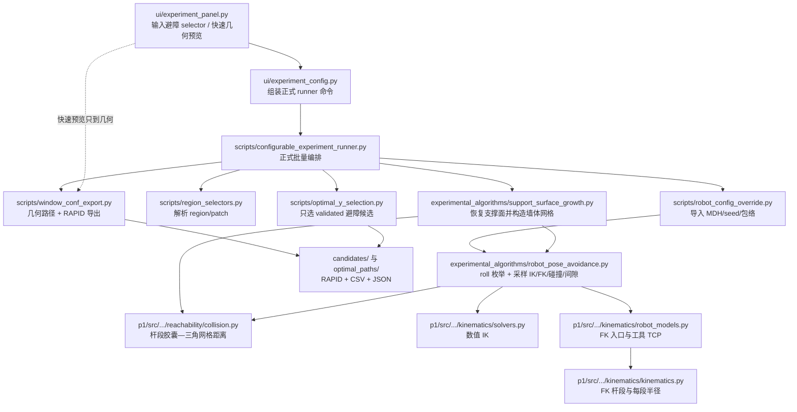

# ABB 6700 避障文件地图与当前能力边界

> 核对日期：2026-08-05。本文按当前代码调用关系整理。“避障”在本项目中包含两件
> 不同的事：孔洞处的 TCP 抬刀转场，以及机械臂杆件相对工件墙体的实验性碰撞粗筛。

## 1. 结论

当前项目有碰撞检测代码，但还不是完整的碰撞避障规划器：

- 普通路径规划先按表面几何生成 TCP raster，不读取机器人碰撞模型。
- `auto/hole-aware` 只避免 TCP 在孔洞或无表面支撑处贴面直穿；它不处理机器人杆件。
- 只有用户明确填写“避障区域”并正式运行 configurable runner 时，才会对最多 7 个
  代表路径点枚举 `-90°` 到 `+90°`、间隔 `15°` 的 13 个固定 TCP-Z roll，运行 IK/FK 和杆段—墙体粗筛。
- 避障运行显式导入 `.rsc.json` 时使用各杆段配置包络；未导入时使用统一 100 mm
  半径回退并在 summary 中记录 `uniform-radius-links`。
- 粗筛只验证离散代表姿态，不验证相邻目标之间的连续 MoveL/MoveJ 扫掠；也不包含工具
  实体、自碰撞、底座、地轨、转台和环境设备。
- 未通过粗筛的几何路径仍写入 `candidates/` 供诊断，但不会进入 `optimal_paths/`。

因此，`candidates/` 或 UI 快速预览中的轨迹与模型干涉并不矛盾：这些输出可能尚未验证，
或者干涉发生在当前粗筛没有建模/没有采样到的连续运动或实体上。

## 2. 当前调用图



## 3. 实验目录中的运行时代码

| 文件 | 作用 | 是否真正做碰撞判断 |
| --- | --- | --- |
| `ui/experiment_panel.py` | 避障区域与杆系配置 UI；快速预览只显示几何并标记“待正式运行 IK/FK” | 否 |
| `ui/experiment_config.py` | 把 selector、最小间隙、机器人配置路径拼入正式 runner 命令 | 否 |
| `ui/region_viewer.py` | 提供支撑面种子/绿色支撑面/红色障碍面的着色函数；当前调用链中尚未调用该函数 | 否 |
| `scripts/region_selectors.py` | 解析 `1`、`1-1`、`1_1`、`1.1` 并匹配 source region/patch | 否 |
| `scripts/robot_config_override.py` | 读取主程序 `.rsc.json`，验证 6 轴 MDH 和包络尺寸，提供碰撞半径设置 | 只配置模型 |
| `scripts/window_conf_export.py` | 生成几何路径、孔洞/cell 抬刀、150 mm 接近/离开点和 RAPID；同时作为实验模块的导入汇总层 | 本身不筛机器人碰撞 |
| `experimental_algorithms/support_surface_growth.py` | 从最终路径 `face_id` 恢复近共面支撑面；从障碍网格移除支撑面并抽样最多 6000 个墙体三角形 | 构造碰撞网格 |
| `experimental_algorithms/robot_pose_avoidance.py` | 枚举 13 个固定 TCP-Z roll；每个候选最多抽 7 点，做数值 IK、关节跳变、J5、FK 杆段碰撞和间隙 | 是，离散粗筛 |
| `scripts/configurable_experiment_runner.py` | 正式总编排；只对 selector 命中的路径调用支撑面恢复和姿态筛查，写报告并过滤 optimal 输入 | 调度 |
| `scripts/optimal_y_selection.py` | 普通路径按 world-Y 评分；避障路径只在已验证候选中最大化抽样最小机械臂净间隙，不按 roll 排序 | 否 |

## 4. `p1/src` 中直接或关键支撑文件

| 文件 | 作用 | 当前接入状态 |
| --- | --- | --- |
| `robot_studio_qt/tools/reachability/collision.py` | `CollisionMesh`、`CollisionSettings` 和杆段到三角形距离；把连杆近似成有半径线段/胶囊 | 被实验避障直接复用 |
| `robot_studio_qt/kinematics/kinematics.py` | 定义 `Segment`；根据 FK frame 生成杆段名称、端点和包络半径 | 被实验避障间接复用 |
| `robot_studio_qt/kinematics/robot_models.py` | `SerialRobotModel`，把关节状态、机器人配置和工具 TCP 组合成 FK/IK 模型 | 被实验避障直接复用 |
| `robot_studio_qt/kinematics/solvers.py` | 数值 IK；实验避障用上一成功解作为下一采样点 seed | 被实验避障直接复用 |
| `robot_studio_qt/kinematics/model.py` | `JointState`、`RobotConfiguration`、MDH/关节限位/包络字段 | 数据合同 |
| `robot_studio_qt/polishing_tool/models.py`、`transforms.py` | 保存 flange-to-TCP；IK 以 TCP 偏置求法兰目标 | 工具实体几何未进入碰撞 |
| `robot_studio_qt/tools/reachability/service.py` | 主软件“可达性分析”做完整路径 IK、构型、关节跳变和 J5 检查 | **没有接入 collision.py** |
| `robot_studio_qt/path_planning/service.py`、`mesh_raster.py` | 主软件根据选面生成 TCP raster | 生成时不读取机器人碰撞模型 |
| `robot_studio_qt/path_planning/exporters.py` | 主软件通用路径导出 | 不做碰撞验证 |
| `robot_studio_qt/ui/main_window.py` | 主软件路径生成与可达性按钮的调用入口 | 路径生成和可达性均不调用碰撞模块 |

## 5. 测试与说明文件

| 文件 | 覆盖内容 |
| --- | --- |
| `tests/test_robot_pose_avoidance.py` | roll、采样 IK/FK 状态、碰撞/间隙、回退状态 |
| `tests/test_support_surface_growth.py` | 支撑面区域生长和障碍网格构造 |
| `tests/test_robot_config_override.py` | `.rsc.json` 校验和包络半径 |
| `tests/test_optimal_y_selection.py` | 避障候选的最优筛选规则 |
| `tests/test_experiment_ui_config.py` | UI 参数到 runner 命令 |
| `p1/src/tests/tools/test_reachability_collision.py` | 杆段—三角形碰撞距离与包络半径 |
| `docs/ROBOT_ARM_AVOIDANCE_WORKFLOW.md` | 当前实验避障流程、selector、状态和能力边界 |
| `experimental_algorithms/ROBOT_POSE_AVOIDANCE_PRINCIPLES.md` | 姿态粗筛的实验设计原则 |
| `TROUBLESHOOTING.md` | IK unresolved、fallback、支撑面错误等排查 |
| `VALIDATION.md` | 自动与 RobotStudio 人工验收清单 |

## 6. 为什么现在仍会穿模

按代码优先级，最常见原因是：

1. 看的是 UI 快速预览：这里明确不运行避障 IK/FK。
2. 看的是 `candidates/`：未通过或无法完成内部验证的 baseline 也会保留在这里。
3. 没填“避障区域”：未命中的 region 完全不运行杆件碰撞筛查。
4. 即使状态是 validated，也只检查最多 7 个离散目标姿态；MoveL/MoveJ 中间扫掠未检查。
5. 碰撞模型没有工具实体、自碰撞、底座、地轨、转台和环境；RobotStudio 看到的实体比内部
   胶囊杆模型更完整。
6. `.rsc.json` 的单胶囊包络仍不是 ABB 真实 CAD 外壳；未导入时使用统一 100 mm 半径。
7. 支撑面会从障碍网格中排除；支撑面生长过大时，邻近真实墙体可能被误删。
8. 障碍网格最多抽样 6000 个三角形，也可能漏掉局部小障碍。
9. 当前“避障”只改变整条路径的固定 TCP-Z roll，不改变 TCP 位置、不搜索新的空间绕行轨迹，
   也不做全局机器人构型路径规划。

### 6.1 对 2026-07-22 最新结果的核对

旧实验示例 `results/x3500_yM1900_1900_step100_z440_turn_0722_robot_avoid/summary.json`
以及采用新目录命名的实验都在 `summary.json` 中明确记录：

```text
avoidance_requested = 1_1,1_2
collision model = thin-centerline-links
sampled waypoints per trial = 7
continuous_motion_checked = false
```

两个 optimal 记录虽然都是 `baseline-validated`，但内部使用的是未导入 `.rsc.json` 时的
5 mm 细中心杆。对应 RAPID 分别包含 49 和 54 段 MoveL，而粗筛每条候选最多只检查 7 个
离散姿态；所以 RobotStudio 在这些 MoveL 中间或真实 ABB 外壳上发现干涉，是当前模型必然
可能漏报的情况，不代表 RobotStudio 显示错误。

`optimal_paths/` 只表示通过了上述内部抽样粗筛，不表示通过 ABB/RobotStudio 或真实设备
安全验证。最终仍需用完整机器人、真实工具和环境做连续运动碰撞检查。
